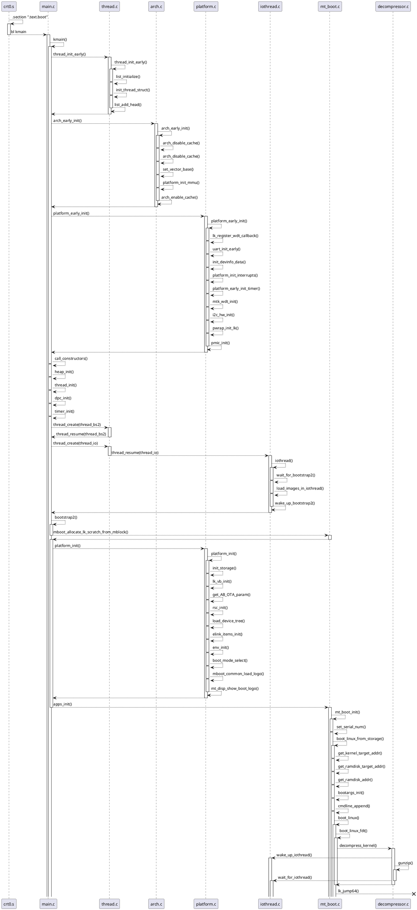

# 基于MTK方案的Android AB分区Boot流程 - LK阶段

前面说到由preloader调用`bldr_jump64`跳转至lk，那我们对lk的流程继续进行分析。本阶段所有代码均在`alps/vendor/mediatek/proprietary/bootable/bootloader/lk`目录下。

## LK阶段流程图

先看一张整个LK的关键代码流程：



## boot段的定义

ld（链接）文件用于定义Mem、stack、section的地址与长度及程序入口，其中在MT6771中代码段boot入口的定义如下：

`lk/arch/arm/system-onesegment.ld`
`lk/arch/arm/system-twosegment.ld`
```ld
# system-onesegment.ld
SECTIONS
{
    . = %MEMBASE%;

    /* text/read-only data */
    .text.boot : { *(.text.boot) }
......
}

# system-twosegment.ld
SECTIONS
{
    . = %ROMBASE%;

    /* text/read-only data */
    .text.boot : { *(.text.boot) }
......
}
```

而`.text.boot`的入口地址定义在`lk/arch/arm/crt0.S`中:

```s
.section ".text.boot"
.globl _start
_start:
	b	reset
	b	arm_undefined
	b	arm_syscall
	b	arm_prefetch_abort
	b	arm_data_abort
	b	arm_reserved
	b	arm_irq
	b	arm_fiq

/*pre-loader to uboot argument Location*/
.global BOOT_ARGUMENT_LOCATION
BOOT_ARGUMENT_LOCATION:
        .word 0x00000000
......
	bl		kmain
	b		.
......
```

经过一些初始化的准备操作后，通过启动汇编跳转到C代码的入口函数`lk/kernel/main.c::kmain()`开始执行。

## kmain入口函数分析

```c
void kmain(void)
{
    // 开始计时lk的boot时长,boot_time用于统计
    // 从kmain开始到jump至kernel的总时长。
    boot_time = get_timer(0);

    // get us into some sort of thread context
    thread_init_early();

    // 架构的早期初始化工作
    arch_early_init();

    // 平台的早期初始化工作
    platform_early_init();

    // MTK给各平台预留的空函数，后续可能会增加一些前期初始化的功能
    target_early_init();

    // 串口打印如下提示信息，表示已经成功跳转至lk
    dprintf(INFO, "welcome to lk\n\n");
    dprintf(INFO, "LK_VER_TAG = %s\n", LK_VER_TAG);

    // deal with any static constructors
    dprintf(SPEW, "calling constructors\n");
    call_constructors();

    // bring up the kernel heap
    dprintf(SPEW, "initializing heap\n");
    heap_init();

    // initialize the threading system
    dprintf(SPEW, "initializing threads\n");
    thread_init();

    // initialize the dpc system
    dprintf(SPEW, "initializing dpc\n");
    dpc_init();

    // initialize kernel timers
    dprintf(SPEW, "initializing timers\n");
    timer_init();

......

#if (!ENABLE_NANDWRITE)
    // create a thread to complete system initialization
    dprintf(SPEW, "creating bootstrap completion thread\n");

    // 创建一个thread用于执行bootstrap2，执行结束后唤醒iothread
    thread_t *thread_bs2 = thread_create("bootstrap2", &bootstrap2, NULL,
            DEFAULT_PRIORITY, DEFAULT_STACK_SIZE);
    if (thread_bs2)
        thread_resume(thread_bs2);
    else {
        dprintf(CRITICAL, "Error: Cannot create bootstrap2 thread!\n");
        assert(0);
    }

    // 创建一个iothread用于等待bootstrap2执行结束，并执行load image的操作
    thread_t *thread_io = thread_create("iothread", &iothread, NULL,
            IO_THREAD_PRIORITY, DEFAULT_STACK_SIZE);
    if (thread_io)
        thread_resume(thread_io);
    else {
        dprintf(CRITICAL, "Error: Cannot create I/O thread!\n");
        assert(0);
    }

    // enable interrupts
    exit_critical_section();

    // 成为一个空闲的线程
    thread_become_idle();
#else
......
#endif
}
```

注：若发现串口的打印没有debug的log，可以在`include/debug.h`与`platform/pal/pal_log.c|h`将debug的log打开：

```c
// include/debug.h
#define DEBUGLEVEL 2
// platform/pal/pal_log.h
#define BUILD_DEBUG_LOG      (1)
// platform/pal/pal_log.c
static uint32_t g_log_level = LOG_LEVEL_DEBUG;
```

根据上面的`kmain()`的整体流程，我们下面逐步分析每个子模块内部流程：

### arch_early_init

`arch/arm/arch.c`

```c
// platform/mt6771/rules.mk
ARM_CPU := cortex-a53
// arch/arm/rules.mk
ifeq ($(ARM_CPU),cortex-a53)
DEFINES += \
        ARM_WITH_CP15=1 \
        ARM_WITH_MMU=1 \
        ARM_ISA_ARMv7=1 \
        ARM_WITH_VFP=1 \
        ARM_WITH_NEON=1 \
        ARM_WITH_THUMB=1 \
        ARM_WITH_THUMB2=1 \
        ARM_WITH_CACHE=1 \
        ARM_WITH_L2=1

// platform/mt6771/rules.mk
MTK_3LEVEL_PAGETABLE := yes
ifeq ($(MTK_3LEVEL_PAGETABLE), yes)
    DEFINES += MTK_3LEVEL_PAGETABLE
endif

void arch_early_init(void)
{
    /* 关闭cache */
    arch_disable_cache(UCACHE);
......

    /* 配置异常向量表起始地址为SDRAM的地址*/
#if ARM_ISA_ARMV7
    // target/tb8788p1_64_wifi/rules.mk :: MEMBASE := 0x56000000 # SDRAM
    set_vector_base(MEMBASE);
#endif

#if ARM_WITH_MMU
#ifdef MTK_3LEVEL_PAGETABLE
    platform_init_mmu(); //mmu的初始化
#else   //!MTK_3LEVEL_PAGETABLE
......
#endif  //MTK_3LEVEL_PAGETABLE
#endif

    /* 重新打开cache */
    arch_enable_cache(UCACHE);
......
#if ARM_WITH_NEON
    /* 使能cp10和cp11寄存器，CP10、CP11 两个协处理器一起，
       提供了浮点运算和向量操作，以及高级的 SIMD 指令扩展 */
    uint32_t val;
    __asm__ volatile("mrc   p15, 0, %0, c1, c0, 2" : "=r" (val));
    val |= (3<<22)|(3<<20);
    __asm__ volatile("mcr   p15, 0, %0, c1, c0, 2" :: "r" (val));

    /* set enable bit in fpexc */
    __asm__ volatile("mrc  p10, 7, %0, c8, c0, 0" : "=r" (val));
    val |= (1<<30);
    __asm__ volatile("mcr  p10, 7, %0, c8, c0, 0" :: "r" (val));
#endif
......
}
```

所以总的来说，`arch_eraly_init()`就是对指定平台（mt6771）的初始化，使能MMU，preloader运行在ISRAM，属于物理地址，而lk运行在DRAM，开启MMU能够加速LK的加载过程。

### platform_early_init

`platform/mt6771/platform.c`

```c
void platform_early_init(void)
{
    PROFILING_START("platform_early_init");
    // 注册看门狗回调
    lk_register_wdt_callback();

    // uart的初始化
    uart_init_early();

    PROFILING_START("Devinfo Init");
    init_devinfo_data();
    PROFILING_END();

    // 中断及定时器的初始化
    platform_init_interrupts();
    platform_early_init_timer();
......
    dprintf(SPEW, "bootarg_addr: 0x%x, bootarg_size: 0x%x\n", platform_get_bootarg_addr(), platform_get_bootarg_size());

    if (g_dram_init_ret < 0) {
        dprintf(CRITICAL, "[LK ERROR] DRAM bank number is not correct!!!\n");
        while (1) ;
    }

    //i2c_v1_init();
    PROFILING_START("WDT Init");
    mtk_wdt_init();
    PROFILING_END();

    //i2c init
    i2c_hw_init();
......
    pwrap_init_lk();

#if !defined(MACH_FPGA) && !defined(NO_PMIC)
    PROFILING_START("pmic_init");
    pmic_init();
    PROFILING_END();
#endif  // !defined(MACH_FPGA) && !defined(NO_PMIC)
    PROFILING_END(); /* platform_early_init */
}
```

`platform_early_init`进行了平台硬件早期初始化，包括irq、timer，wdt，uart，pmic，i2c，gpio等, 初始化平台硬件，建立lk基本运行环境。

### bootstrap2与iothread

经过早期初始化后，在kmain中对内核堆链表的上下文进行初始化（heap_init）、对线程池初始化（thread_init）、内核定时器初始化（timer_init）之后创建了两个线程分别执行，那就是`bootstrap2`与`iothread`。

```c
static int bootstrap2(void *arg)
{
    dprintf(SPEW, "top of bootstrap2()\n");
    print_stack_of_current_thread();// 串口打印一下当前线程的堆栈
    arch_init();// 在mt6771上是空函数
......
    // 申请一块在LK期间使用的内存，在跳转至kernel前进行释放
    mboot_allocate_lk_scratch_from_mblock();

    // initialize the rest of the platform
    dprintf(SPEW, "initializing platform\n");
    platform_init(); // 真正的平台初始化，会初始化各种驱动，稍后分析

    dprintf(SPEW, "initializing target\n");
    target_init(); // 平台预留的空函数

    dprintf(SPEW, "calling apps_init()\n");
    // 跳转到mt_boot_init入口开始执行,对应启动汇编中的 ".apps" 这个section.
    apps_init();

    return 0;
}
```

所以在`bootstrap2`这个线程中首先申请一块内存，之后经过平台初始化后会跳转至.app段，也就是`mt_boot_init`方法中，稍后再对这个方法进行分析，接下来我们看一下iothread中干了什么。

`app/mt_boot/iothread.c|h`
```c
#define wake_up_iothread()                                                    \
    do {                                                                  \
        dprintf(INFO, "Wake up iothread.\n");                         \
        event_signal(&iothread_start_event, false);                   \
    } while (0)


#define wait_for_bootstrap2()                                                 \
    do {                                                                  \
        dprintf(INFO, "Wait for bootstrap2...\n");                    \
        event_wait(&iothread_start_event);                            \
        event_unsignal(&iothread_start_event);                        \
        dprintf(INFO, "Met bootstrap2.\n");                           \
    } while (0)

int iothread(void *arg)
{
    event_init(&iothread_start_event, false, 0);
    event_init(&iothread_end_event, false, 0);
    dprintf(INFO, "iothread starts.\n");

    // 等待bootstrap2
    wait_for_bootstrap2();

    // 在该线程中加载vpu/spm/mcupm/scp/modem/adsp镜像
    load_images_in_iothread(g_boot_mode);

    // 重新唤醒bootstrap2
    wake_up_bootstrap2();

    return 0;
}

static void do_load_images(BOOTMODE mode)
{
    if (RECOVERY_BOOT != mode) {
        do_load_vpu(mode);
        do_load_spm(mode);
        do_load_mcupm(mode);
    }
    do_load_scp(mode);
    do_load_modem(mode);
    do_load_adsp(mode);
}
```

`iothread`被创建后就一直在等待被bootstrap2唤醒，之后会去加载在bootstrap2中没有被加载的镜像，之后重新回到bootstrap2。

### platform_init

刚才说到在bootstrap2中首先会进行平台端的初始化工作，那我们具体看看都初始化了些什么：

```c
void platform_init(void)
{
......
	PROFILING_START("platform_init");
	dprintf(CRITICAL, "platform_init()\n");

	init_storage();
	lk_vb_init();
......

#ifdef MTK_AB_OTA_UPDATER
	get_AB_OTA_param();// 在获取设备树前获取AB分区的参数
#endif
	rsc_init(); // RSC的初始化，该函数内会解析设备树节点
	load_device_tree(); // 读取设备树
......

#ifdef ELINK_ITEMS_SUPPORT
	elink_items_init(); //可以看到品网的items分区也是在这个时候进行初始化操作的
#endif
......

	PROFILING_START("ENV init");
	env_init();
	print_env();
	PROFILING_END();

	PROFILING_START("disp init");
// modified by elink_phil start <<<
    vibr_Enable_3v3();// power for TP and DC converter
	elink_disp_init(elink_get_lcm_control());
// modified end >>>

	/* 执行显示相关的初始化，包括frame buffer的定义 */
	dprintf(CRITICAL, "FB base = 0x%x, FB size = 0x%x (%d)\n", g_fb_base, g_fb_size, g_fb_size);
......

	PROFILING_START("boot mode select");

#if !defined(NO_BOOT_MODE_SEL)
	boot_mode_select(); // 选择启动模式
#endif
......
	PROFILING_END(); /* boot mode select */
......

// 开始从logo.bin中加载logo
#ifndef MACH_FPGA_NO_DISPLAY
	if(g_boot_mode != META_BOOT){
	PROFILING_START("load_logo");
	logo_size = mboot_common_load_logo((unsigned long)mt_get_logo_db_addr_pa(), "logo");
	assert(logo_size <= LK_LOGO_MAX_SIZE);
	PROFILING_END();
	} else {
		/* Indicate logo lib that logo partition is not loaded */
		enable_logo(0);
	}
#endif // MACH_FPGA_NO_DISPLAY

	lk_vb_vfy_logo();

	/* 若启动进入刷机模式，则跳转至Download Agent执行刷机操作 */
	if (g_boot_arg->boot_mode == DOWNLOAD_BOOT) {
		dprintf(CRITICAL, "[LK] boot mode is DOWNLOAD_BOOT\n");
		......
		jump_da(g_boot_arg->da_info.addr, g_boot_arg->da_info.arg1, g_boot_arg->da_info.arg2);
	} else if (g_boot_mode != ALARM_BOOT && g_boot_mode != FASTBOOT
				&& g_boot_mode != KERNEL_POWER_OFF_CHARGING_BOOT
				&& g_boot_mode != LOW_POWER_OFF_CHARGING_BOOT
				&& mtk_bat_allow_backlight_enable()) {
......
		// 显示logo
		PROFILING_START("show logo");
		mt_disp_show_boot_logo();
		PROFILING_END(); /* show logo */
	}
#endif // MTK_KERNEL_POWER_OFF_CHARGING

......
	PROFILING_END(); /* platform_init */
}
```

看到，在`platform_init`中，在进行了一些硬件（RTC、EMMC、LCM）等初始化，并且会根据启动情况填充g_boot_mode，选择对应的启动模式，之后再整个显示资源准备就绪后则加载和显示logo，这里也就是第一帧logo了。

### apps_init

最终，执行完平台初始化后bootstrap2会通过apps_init跳转至mt_boot_init方法，重点看一下这里的跳转机制：

`app/app.c`

```c
void apps_init(void)
{
	const struct app_descriptor *app;

	/* call all the init routines */
	for (app = __apps_start; app != __apps_end; app++) {
		if (app->init)
			app->init(app);
	}

	/* start any that want to start on boot */
	for (app = __apps_start; app != __apps_end; app++) {
		if (app->entry && (app->flags & APP_FLAG_DONT_START_ON_BOOT) == 0) {
			start_app(app);
		}
	}
}
```

其中，`__apps_start`与`__app_end`定义在最开始讲到的链接文件中：

`lk/arch/arm/system-onesegment.ld`

```
	.rodata : {
		*(.rodata .rodata.* .gnu.linkonce.r.*)
......
		. = ALIGN(4);
		__apps_start = .;
		KEEP (*(.apps))
		__apps_end = .;
		. = ALIGN(4);
		__rodata_end = . ;
	}
```

该mem的地址范围为`__apps_start`到`__app_end`，也就是`.apps`这个段的内容，而`.apps`则是在`mt_boot.c`中定义：

`app/mt_boot/mt_boot.c | h`

```c
// mt_boot.h
#define APP_START(appname) struct app_descriptor _app_##appname __SECTION(".apps") = { .name = #appname,
#define APP_END };

// mt_boot.c
APP_START(mt_boot)
.init = mt_boot_init,
 APP_END
```

因此，此处的跳转逻辑就是，在编译链接阶段，会将`mt_boot_init`这个入口地址填充到`.apps`这个段中，因此执行`app->init(app)`也就是执行了`void mt_boot_init(const struct app_descriptor *app)`函数。

## Boot kernel from storage

`app/mt_boot/mt_boot.c`

```c
void mt_boot_init(const struct app_descriptor *app)
{
......
	set_serial_num(); //读取并配置传入kernel的sn号
	if (g_boot_mode == FASTBOOT)
		goto fastboot;
#if MTK_FORCE_VERIFIED_BOOT_SIG_VFY
......
#else
	if (0 != sec_boot_check(0))
		g_boot_state = BOOT_STATE_RED;
#endif
#endif

	// 开始准备启动Kernel，并且不再返回
	boot_linux_from_storage();

fastboot: // 进入fastboot模式
	......
}
```

从bootstrap2跳转过来后就开始准备启动kernel了, 可以看到在TC02/DT15中读取并设置SN号的方式：

```c
#define SERIAL_NUM_FROM_BARCODE

#ifdef SERIAL_NUM_FROM_BARCODE
static inline int read_product_info(char *buf)
{
	int tmp = 0;

	if (!buf) return 0;

	mboot_recovery_load_raw_part("proinfo", buf, SN_BUF_LEN);

	for (; tmp < SN_BUF_LEN; tmp++) {
		if ((buf[tmp] == 0 || buf[tmp] == 0x20) && tmp > 0)
			break;

		else if (!isalpha(buf[tmp]) && !isdigit(buf[tmp]))
			break;
	}
	return tmp;
}
#endif

static void set_serial_num(void)
{
......
#ifdef SERIAL_NUM_FROM_BARCODE
	len = (unsigned int)read_product_info(sn_buf);  // sn_buf[] may be changed.
	if (len == 0) {
		len = strlen(DEFAULT_SERIAL_NUM);
		len = (len < SN_BUF_LEN) ? len : SN_BUF_LEN;
		strncpy(sn_buf, DEFAULT_SERIAL_NUM, len);
	} else
		len = (len < SN_BUF_LEN) ? len : SN_BUF_LEN;
	sn_buf[len] = '\0';
#endif  // SERIAL_NUM_FROM_BARCODE
......
}
```

接下来就是boot kernel的准备工作了。

### boot_linux_from_storage

```c
int boot_linux_from_storage(void)
{
......
    // 根据g_boot_mode的状态选择从Boot启动还是Recovery启动
    switch (g_boot_mode) {
        case NORMAL_BOOT: // 正常启动
        case META_BOOT:
        case ADVMETA_BOOT:
        case SW_REBOOT:
        case ALARM_BOOT:
#ifdef MTK_KERNEL_POWER_OFF_CHARGING // 充电模式下的boot
        case KERNEL_POWER_OFF_CHARGING_BOOT:
        case LOW_POWER_OFF_CHARGING_BOOT:
#endif
            PROFILING_START("load boot image");
            // 【重要】调用load_vfy_boot加载校验过的boot分区
            ret = load_vfy_boot(BOOTIMG_TYPE_BOOT, CFG_BOOTIMG_LOAD_ADDR);
            PAL_ASSERT(ret >= 0);
            PROFILING_END();
            break;
        case RECOVERY_BOOT: // 从recovery启动
            PROFILING_START("load recovery image");
            // 【重要】调用load_vfy_boot加载校验过的recovery分区
            ret = load_vfy_boot(BOOTIMG_TYPE_RECOVERY, CFG_BOOTIMG_LOAD_ADDR);
            PAL_ASSERT(ret >= 0);
            PROFILING_END();
            break;
        case FACTORY_BOOT:
        case ATE_FACTORY_BOOT:
            // 启动MTK的工厂模式
            ......
        case FASTBOOT:
        case DOWNLOAD_BOOT:
        case UNKNOWN_BOOT:
            break;

    }
    // 获取kernel等启动的地址
    kernel_target_addr = get_kernel_target_addr();
    ramdisk_target_addr = get_ramdisk_target_addr();
    ramdisk_addr = get_ramdisk_addr();
    ramdisk_real_sz = get_ramdisk_real_sz();
    tags_target_addr = get_tags_addr();

    // 启动地址的错误校验
    PAL_ASSERT(kernel_target_addr != 0);
    PAL_ASSERT(ramdisk_target_addr != 0);
    PAL_ASSERT(ramdisk_addr != 0);
#if (!defined(SYSTEM_AS_ROOT) && !defined(MTK_RECOVERY_RAMDISK_SPLIT))
    PAL_ASSERT(ramdisk_real_sz != 0);
#endif

#ifdef MTK_3LEVEL_PAGETABLE
    /* rootfs addr */
    arch_mmu_map((uint64_t)ramdisk_target_addr, (uint32_t)ramdisk_target_addr,
            MMU_MEMORY_TYPE_NORMAL_WRITE_BACK | MMU_MEMORY_AP_P_RW_U_NA,
            ROUNDUP(LK_RAMDISK_MAX_SIZE, PAGE_SIZE));
#endif
#ifdef MTK_RECOVERY_RAMDISK_SPLIT
    if (g_boot_mode == RECOVERY_BOOT) {
        uint32_t ramdisk_compressed_sz;
        load_vfy_ramdisk(&ramdisk_compressed_sz);
        ramdisk_real_sz = ramdisk_compressed_sz;
    }
    else
#endif /* MTK_RECOVERY_RAMDISK_SPLIT */
        /* 重新定位根文件系统（rootfs）地址 */
        memcpy((void *)ramdisk_target_addr, (void *)ramdisk_addr, (size_t)ramdisk_real_sz);
    /*
     * merge dtb's bootargs with customized cmdline
     * as early as possible
     */
    bootargs_init((void *)tags_target_addr);

    custom_port_in_kernel(g_boot_mode, cmdline_get());

    /* append cmdline from bootimg hdr */
    cmdline_append(get_cmdline());

// 配置传入Kernel的SELinux状态参数
#ifdef SELINUX_STATUS
#if SELINUX_STATUS == 1
    cmdline_append("androidboot.selinux=disabled");
#elif SELINUX_STATUS == 2
    cmdline_append("androidboot.selinux=permissive");
#endif
#endif

    /* This is patch for Android Test Mode(ATM). */
    // Android Test Mode相关的命令行参数判断
    ......

    // MTK read printk ratelimit config
    read_ratelimit_config();
#if !defined(SYSTEM_AS_ROOT) && defined(RECOVERY_AS_BOOT)
    /* 在Android Q中只要开启了AB分区OTA升级就定义了RECOVERY_AS_BOOT
     * 正常启动和从Recovery启动均是同一个boot分区, recovery的ramdisk
     * 存放在root目录下，而normal boot存放在另一个子目录下
     */
#if !defined(MTK_RECOVERY_RAMDISK_SPLIT)
    if (g_boot_mode != RECOVERY_BOOT)
        cmdline_append("androidboot.force_normal_boot=1");
#endif
#endif
    ......
    // 准备启动Linux Kernel
    boot_linux((void *)kernel_target_addr, (unsigned *)tags_target_addr,
            board_machtype(), (void *)ramdisk_target_addr, ramdisk_real_sz);
    return 0;
}
```

因此，可以看到，boot_linux_from_storage中根据g_boot_mode选择各种启动模式(normal、facotry、fastboot、recovery)等,然后从EMMC中boot分区找到(解压) ramdisk跟zImage的地址load到DRAM中；kernel最终load到DRAM的地址，之后重定位根文件系统地址，并跳转至boot_linux，正式拉起kernel；

```c
void boot_linux(void *kernel, unsigned *tags,
		unsigned machtype,
		void *ramdisk, unsigned ramdisk_sz)
{
#ifdef DEVICE_TREE_SUPPORT
	boot_linux_fdt((void *)kernel, (unsigned *)tags,
		       machtype,
		       (void *)ramdisk, ramdisk_sz);
	panic("%s Fail to enter EL1\n", __func__);
#endif
}

int boot_linux_fdt(void *kernel, unsigned *tags,
		   unsigned machtype,
		   void *ramdisk, unsigned ramdisk_sz)
{
......
	kernel_load_addr = get_kernel_addr();
	if (g_is_64bit_kernel) {
		zimage_size = get_kernel_real_sz();

		pal_log_info("64 bits kernel\n");
		pal_log_err("kernel real kernel_sz=0x%08x\n", zimage_size);

		if ((uint32_t)kernel_target_addr & 0x7FFFF) {
			panic("64 bit kernel can't boot at 0x%08x\n",
					(uint32_t)kernel_target_addr);
		}
		pal_log_info("zimage_size=0x%08x, zimage_size=0x%08x\n",
				zimage_size, zimage_size);
		pal_log_info("decompress kernel image...\n");

		/* for 64bit decompreesed size.
		 * LK start: 0x41E00000, Kernel Start: 0x40080000
		 * Max is 0x41E00000 - 0x40080000 = 0x1D80000.
		 * using 0x1C00000=28MB for decompressed kernel image size */
		if (decompress_kernel((unsigned char *)(kernel_load_addr),
				      (void *)kernel_target_addr, (int)zimage_size,
				      (int)decompress_outbuf_size)) { // 解压内核镜像
			panic("decompress kernel image fail!!!\n");
		}
	} else {
		......
	}

......
    // 准备传入内核的参数列表

	// 跳转至kernel
	if (g_is_64bit_kernel) {
		lk_jump64((u32)entry, (u32)tags, 0, KERNEL_64BITS);
	} else {
......
	}
	panic("%s Fail to enter EL1\n", __func__);
	return 0;
}
```

`app/mt_boot/decompressor.c`

```c
bool decompress_kernel(unsigned char *in, void *out, int inlen, int outlen)
{
	unsigned long lenp = inlen;
	int ret;

	wake_up_iothread(); // 在这里重新唤醒了iothread进行image的load操作

	PROFILING_START("decompress_kernel");
	ret = gunzip(in, &lenp, out, outlen); // 通过unzip解压内核镜像
	PROFILING_END();

	wait_for_iothread(); // 等待iothread结束

	return ret;
}
```

根据上面的代码可以看到，在`boot_linux_fdt`中调用`decompress_kernel`来解压kernel，在其中会唤醒之前的`iothread`来load其他的image，最终完成解压后准备相应的环境及需要传入内核的参数列表后真正跳转至kernel，跳转完成后会有如下打印：

```
[9664] cmdline: console=tty0 console=ttyS0,921600n1 vmalloc=400M slub_debug=OFZPU swiotlb=noforce page_owner=on cgroup.memory=nosocket,nokmem a
[9667]        : ndroidboot.hardware=mt6771 firmware_class.path=/vendor/firmware loop.max_part=7 has_battery_removed=0 androidboot.boot_devices=
[9670]        : bootdevice,11230000.mmc root=/dev/ram androidboot.vbmeta.device=PARTUUID=8c68cd2a-ccc9-4c5d-8b57-34ae9b2dd481 androidboot.vbmet
[9673]        : a.avb_version=1.1 androidboot.vbmeta.device_state=unlocked androidboot.veritymode=enforcing androidboot.veritymode.managed=yes 
[9676]        : androidboot.slot_suffix=_a androidboot.slot=a androidboot.verifiedbootstate=orange bootopt=64S3,32N2,64N2 buildvariant=userdebu
[9679]        : g ddr_name= ddr_speed=0 androidboot.atm=disabled androidboot.force_normal_boot=1 androidboot.meta_log_disable=0 printk.disable_
[9682]        : uart=0 bootprof.pl_t=6005 bootprof.lk_t=9212 bootprof.logo_t=1881 androidboot.serialno=YLH2144100004 androidboot.bootreason=usb
[9685]        :  gpt=1 usb2jtag_mode=0 mrdump_ddrsv=yes mrdump_cb=0x11e000,0x2000 mrdump.lk=MRDUMP08 androidboot.dtb_idx=0 androidboot.dtbo_idx
[9688]        : =0
[9689] lk boot time = 9212 ms
[9690] lk boot mode = 0
[9690] lk boot reason = 1
[9691] lk finished --> jump to linux kernel 64Bit

[LK]jump to K64 0x40080000
```

至此，LK阶段结束，进入kernel 的世界。

