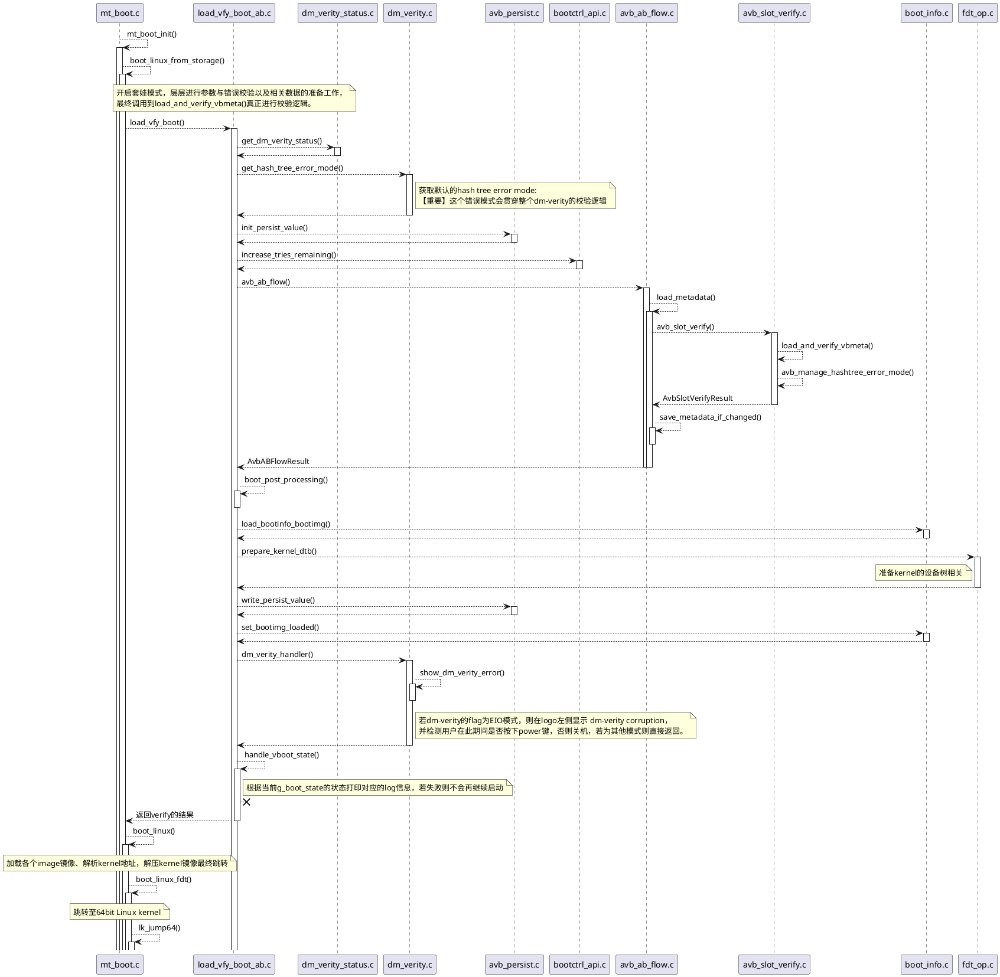

# MTK AB方案的dm-verity机制详解 - 售后开机异常问题分析

## 一、问题背景


随着售后机器出货越来越多，售后问题中用户异常重启、关机等问题也愈加频繁，经常有机器出现用过一段时间后机器突然重启并在开机logo左侧显示`dm-verity corruption`的提示，之后系统频繁重启，因此需要对dm-verity机制进行深入研究，找出其出现问题的根本原因。

## 二、什么是DM-Verity与AVB

dm-verity机制其实是Linux基于device-mapper的机器实现的一种磁盘数据校验机制，为了防止系统数据被篡改，而加入的hash树校验机制，Android中的dm-verity与AVB（Android Verified Boot）息息相关，AVB具体的校验机制其实是通过校验vbmeta分区的内容，对比链式hash结构值，判断数据是否有篡改，若校验失败则表明数据存在问题。


其中VBMeta的数据结构是AVB的关键，vbmeta的镜像中保存了各个重要分区的hash校验值与公钥，进行链式存储，AB分区的vbmeta结构如下图所示：


关于AVB详细的解释详见Google官方文档 - [Android Verified Boot 2.0](https://android.googlesource.com/platform/external/avb/+/master/README.md#The-VBMeta-struct)

## 三、流程追踪

经过结合日志信息持续的代码追踪，整理出来的dm-verity在lk阶段的流程如下：



## 四、重点代码解析

根据logo左侧的提示可以找到对应打印提示的地方在`platform/common/boot/avb20/dm_verity.c`中，可以看到在dm-verity的哈希校验出现EIO模式时则会调用show_dm_verity_error方法在开机logo左侧显示对应的提示，并且检测power键在此期间是否按下，如果检测到有power键按下则进入系统：

`alps/vendor/mediatek/proprietary/bootable/bootloader/lk/platform/common/boot/avb20/dm_verity.c`

```c
static void show_dm_verity_error(void)
{
    unsigned int wait_time = 0;

    // 开机logo左侧显示的dm-verity出错提示
    video_clean_screen();
    video_set_cursor(video_get_rows() / 2, 0);
    video_printf("dm-verity corruption\n\n");
    video_printf("Your device is corrupt.\n");
    video_printf("It can't be trusted and may not work properly.\n");
    video_printf("Press power button to continue.\n");
    video_printf("Or, device will power off in %ds\n", DM_VERITY_ERROR_WAIT_TIME / 1000);

    // #define DM_VERITY_ERROR_WAIT_TIME (5000)
    // 等待5s，若没有检测到用户按下Power键，则进行关机
    while (wait_time < DM_VERITY_ERROR_WAIT_TIME) {
        if (mtk_detect_key(MTK_PMIC_PWR_KEY)) // 检测Power键是否按下
            return;
        mdelay(100);
        wait_time += 100;
    }
#ifndef NO_POWER_OFF
// platform/mt6771/rules.mk
// 210:MTK_PMIC_POWER_OFF := yes
// 211:ifeq ($(MTK_PMIC_POWER_OFF), yes)
// 212:    DEFINES += MTK_PMIC_POWER_OFF
#ifdef MTK_PMIC_POWER_OFF
    mt_power_off(); // 执行关机操作
#else
    mt6575_power_off();
#endif
#endif
    return;
}

void dm_verity_handler(AvbHashtreeErrorMode hashtree_error_mode)
{
// platform/mt6771/rules.mk
// 13:AVB_PERSIST_VALUE_SUPPORT:=yes
#ifdef AVB_PERSIST_VALUE_SUPPORT
    // 查看AVB hashtree的错误模式，如果为EIO模式则在开机logo左侧显示对应的错误
    if (hashtree_error_mode == AVB_HASHTREE_ERROR_MODE_EIO)
        show_dm_verity_error();
#else
    uint32_t status = 0;
    BOOL ota_result = FALSE;
    PAL_UNUSED_PARAM(hashtree_error_mode);

    get_dm_verity_status(&status);

    ota_result = check_ota_result();
    if (ota_result == TRUE) {
        pal_log_info("first boot after OTA.\n");
        clear_dm_verity_status();
        ota_result = clear_ota_result();
        if (ota_result != TRUE)
            pal_log_err("fail to clear ota result.\n");
        status = 0;
    }

    if (status)
        show_dm_verity_error();
#endif
    return;
}
```

第一个开机logo显示的时候处于lk阶段，从preloader跳转到lk后会走到mt_boot中去进行一些准备，之后会从该地方跳转到Linux kernel:

`alps/vendor/mediatek/proprietary/bootable/bootloader/lk/app/mt_boot/mt_boot.c`

```c
int boot_linux_from_storage(void)
{
......
    // 根据g_boot_mode的状态选择从Boot启动还是Recovery启动
    switch (g_boot_mode) {
        case NORMAL_BOOT: // 正常启动
        case META_BOOT:
        case ADVMETA_BOOT:
        case SW_REBOOT:
        case ALARM_BOOT:
#ifdef MTK_KERNEL_POWER_OFF_CHARGING // 充电模式下的boot
        case KERNEL_POWER_OFF_CHARGING_BOOT:
        case LOW_POWER_OFF_CHARGING_BOOT:
#endif
            PROFILING_START("load boot image");
            // 【重要】调用load_vfy_boot加载校验过的boot分区
            ret = load_vfy_boot(BOOTIMG_TYPE_BOOT, CFG_BOOTIMG_LOAD_ADDR);
            PAL_ASSERT(ret >= 0);
            PROFILING_END();
            break;
        case RECOVERY_BOOT: // 从recovery启动
            PROFILING_START("load recovery image");
            // 【重要】调用load_vfy_boot加载校验过的recovery分区
            ret = load_vfy_boot(BOOTIMG_TYPE_RECOVERY, CFG_BOOTIMG_LOAD_ADDR);
            PAL_ASSERT(ret >= 0);
            PROFILING_END();
            break;
        case FACTORY_BOOT:
        case ATE_FACTORY_BOOT:
            // 启动MTK的工厂模式
            ......
        case FASTBOOT:
        case DOWNLOAD_BOOT:
        case UNKNOWN_BOOT:
            break;

    }
    // 获取kernel等启动的地址
    kernel_target_addr = get_kernel_target_addr();
    ramdisk_target_addr = get_ramdisk_target_addr();
    ramdisk_addr = get_ramdisk_addr();
    ramdisk_real_sz = get_ramdisk_real_sz();
    tags_target_addr = get_tags_addr();

    // 启动地址的错误校验
    PAL_ASSERT(kernel_target_addr != 0);
    PAL_ASSERT(ramdisk_target_addr != 0);
    PAL_ASSERT(ramdisk_addr != 0);
#if (!defined(SYSTEM_AS_ROOT) && !defined(MTK_RECOVERY_RAMDISK_SPLIT))
    PAL_ASSERT(ramdisk_real_sz != 0);
#endif

#ifdef MTK_3LEVEL_PAGETABLE
    /* rootfs addr */
    arch_mmu_map((uint64_t)ramdisk_target_addr, (uint32_t)ramdisk_target_addr,
            MMU_MEMORY_TYPE_NORMAL_WRITE_BACK | MMU_MEMORY_AP_P_RW_U_NA,
            ROUNDUP(LK_RAMDISK_MAX_SIZE, PAGE_SIZE));
#endif
#ifdef MTK_RECOVERY_RAMDISK_SPLIT
    if (g_boot_mode == RECOVERY_BOOT) {
        uint32_t ramdisk_compressed_sz;
        load_vfy_ramdisk(&ramdisk_compressed_sz);
        ramdisk_real_sz = ramdisk_compressed_sz;
    }
    else
#endif /* MTK_RECOVERY_RAMDISK_SPLIT */
        /* 重新定位根文件系统（rootfs）地址 */
        memcpy((void *)ramdisk_target_addr, (void *)ramdisk_addr, (size_t)ramdisk_real_sz);
    /*
     * merge dtb's bootargs with customized cmdline
     * as early as possible
     */
    bootargs_init((void *)tags_target_addr);

    custom_port_in_kernel(g_boot_mode, cmdline_get());

    /* append cmdline from bootimg hdr */
    cmdline_append(get_cmdline());

// 配置传入Kernel的SELinux状态参数
#ifdef SELINUX_STATUS
#if SELINUX_STATUS == 1
    cmdline_append("androidboot.selinux=disabled");
#elif SELINUX_STATUS == 2
    cmdline_append("androidboot.selinux=permissive");
#endif
#endif

    /* This is patch for Android Test Mode(ATM). */
    // Android Test Mode相关的命令行参数判断
    ......

    // MTK read printk ratelimit config
    read_ratelimit_config();
#if !defined(SYSTEM_AS_ROOT) && defined(RECOVERY_AS_BOOT)
    /* 在Android Q中只要开启了AB分区OTA升级就定义了RECOVERY_AS_BOOT
     * 正常启动和从Recovery启动均是同一个boot分区, recovery的ramdisk
     * 存放在root目录下，而normal boot存放在另一个子目录下
     */
#if !defined(MTK_RECOVERY_RAMDISK_SPLIT)
    if (g_boot_mode != RECOVERY_BOOT)
        cmdline_append("androidboot.force_normal_boot=1");
#endif
#endif
    ......
    // 准备启动Linux Kernel
    boot_linux((void *)kernel_target_addr, (unsigned *)tags_target_addr,
            board_machtype(), (void *)ramdisk_target_addr, ramdisk_real_sz);
    return 0;
}
```

从上面的`boot_linux_from_storage`可以看到，无论是正常启动还是启动recovery均是通过`load_vfy_boot`这个函数，那我们重点分析一下该函数，这个函数在`load_vfy_boot_ab.c`中：

`alps/vendor/mediatek/proprietary/bootable/bootloader/lk/platform/common/boot/avb20/load_vfy_boot_ab.c`

```c
int load_vfy_boot(uint32_t bootimg_type, uint32_t addr)
{
    int ret = STATUS_OK;
    uint32_t img_vfy_time = 0;
    AvbSlotVerifyResult avb_ret = AVB_SLOT_VERIFY_RESULT_OK;
    AvbSlotVerifyData *slot_data = NULL;

    //【重要】 AVB校验标志，该flag会贯穿整个dm-verity校验
    AvbSlotVerifyFlags avb_flag = AVB_SLOT_VERIFY_FLAGS_NONE;
    uint32_t lock_state = LKS_DEFAULT; // fastboot lock锁状态
    uint32_t dm_status = 0;
    AvbHashtreeErrorMode hashtree_error_mode = AVB_HASHTREE_ERROR_MODE_RESTART_AND_INVALIDATE;

    img_vfy_time = get_timer(0);

    g_boot_state = BOOT_STATE_RED;

    /* heap initialization for avb */
    // 【重要】分配一块100MB的空间给avb堆，用于进行校验，该地址是一个全局变量，供dm-verity验证期间使用
    // 验证流程结束后，该地址空间释放回lk。
    // 62:#define AVB_HEAP_SZ (100 * MB)
    avb_heap_sz = AVB_HEAP_SZ;
    pal_log_debug("[avb] avb heap alloc size 0x%x\n", avb_heap_sz);
    avb_heap = (void *)(uint32_t)mblock_reserve_ext(&g_boot_arg->mblock_info,
            avb_heap_sz, 4 * KB, 0xc0000000, 0, "avb");
    if (avb_heap == 0) {
        pal_log_err("[avb] avb heap alloc fails\n");
        avb_heap_sz = 0;
        return -1;
    } else
        pal_log_debug("[avb] avb heap alloc 0x%x\n", (uint32_t)avb_heap);

......
    // 这里进行了bypass的状态验证，检测当前的系统的验证策略，
    // 若检测结果为0表示绕过验证。
    if (boot_authentication(bootimg_type) == 0)
        avb_flag = AVB_SLOT_VERIFY_FLAGS_ALLOW_VERIFICATION_ERROR;
......

    // 获取当前的dm-verity的状态，该状态记录了上次的dm-verity的校验状态
    // #define SECURITY_AO_BASE (0x1001a000)
    // #define BOOT_MISC2          (SECURITY_AO_BASE + 0x088)
    // 从地址BOOT_MISC2处读取最低位，若最低位置位则表示dm_verity存在问题
    // 将标志位增加AVB_SLOT_VERIFY_FLAGS_RESTART_CAUSED_BY_HASHTREE_CORRUPTION
    // 说明机器是由于dm-verity corruption重启的。
    get_dm_verity_status(&dm_status);
    if (dm_status)
        avb_flag |= AVB_SLOT_VERIFY_FLAGS_RESTART_CAUSED_BY_HASHTREE_CORRUPTION;

    // 获取默认的hash tree error mode:【重要】这个错误模式会贯穿整个dm-verity的校验逻辑
    // 根据platform/common/boot/avb20/dm_verity.c::get_hash_tree_error_mode()中的定义
    // 在mt6771上错误模式默认为AVB_HASHTREE_ERROR_MODE_MANAGED_RESTART_AND_EIO
    get_hash_tree_error_mode((uint32_t *)&hashtree_error_mode);

    ret = init_persist_value(ab_ops.ops, PERSIST_PART_NAME, PERSIST_VALUE_OFFSET);
    if (ret) {
        pal_log_err("init_persist_value ret = 0x%x\n", ret);
        goto end;
    }

    switch (bootimg_type) {
        case BOOTIMG_TYPE_BOOT:
        case BOOTIMG_TYPE_RECOVERY:
            // preloader 和 avb_ab_flow 函数都会在successful_boot标志位为0时
            // 减少剩余重试次数（tries_remainging），在如下三种情况时会增加
            // tries_remainging的值：
            // 1. tries_remaining < AVB_AB_MAX_TRIES_REMAINING
            // 2. tries_remaining > 0
            // 3. successful_boot is equal to 0
            increase_tries_remaining();

            // 【重要】选择系统中的一个slot的boot分区进行verify
            avb_ret = avb_ab_flow(&ab_ops, boot_partitions,
                    avb_flag, hashtree_error_mode, &slot_data);

            // 判断avb_flag，若校验成功则返回AVB_SLOT_VERIFY_RESULT_OK
            if (avb_flag & AVB_SLOT_VERIFY_FLAGS_ALLOW_VERIFICATION_ERROR)
                avb_ret = AVB_SLOT_VERIFY_RESULT_OK;

            if (avb_ret != AVB_SLOT_VERIFY_RESULT_OK)
                goto end;

            break;
        default:
            avb_ret = AVB_SLOT_VERIFY_RESULT_ERROR_INVALID_ARGUMENT;
            goto end;
    }

    if (avb_ret == AVB_SLOT_VERIFY_RESULT_OK) {
        ret = boot_post_processing(ab_ops.ops, bootimg_type, slot_data);
        if (ret)
            goto end;

        // 校验成功后标记系统的g_boot_state为绿色状态
        g_boot_state = BOOT_STATE_GREEN;
......
        if (boot_authentication(bootimg_type) != 0 && g_boot_state == BOOT_STATE_GREEN) {
            ret = record_avb_version(slot_data);// 记录AVB的version
            if (ret != AVB_IO_RESULT_OK) {
                pal_log_err("update avb otp version fail.\n");
                ret = AVB_IO_RESULT_OK;
            }
        }
    }

end:
    // 打印verify的时间
    pal_log_err("[avb] boot/recovery vfy time = %d ms\n",
            (unsigned int)get_timer(img_vfy_time));

    // 查看最终校验后的slot数据中解析出来的hashtree_error_mode
    // 最终的hashtree_error_mode为AVB_HASHTREE_ERROR_MODE_RESTART
    // 或AVB_HASHTREE_ERROR_MODE_EIO中的一种。
    if (slot_data != NULL)
        hashtree_error_mode = slot_data->resolved_hashtree_error_mode;

    // 注意：当该方法调用后avb_heap所申请的内存空间将会被释放回lk，
    // 因此在该方法调用结束后不能再使用avb_heap空间。
    mblock_create(&g_boot_arg->mblock_info, &g_boot_arg->orig_dram_info,
            (uint64_t)(uint32_t)avb_heap & 0xffffffff,
            (uint64_t)avb_heap_sz & 0xffffffff);

    pal_log_err("[avb] avb_ret = %d\n", avb_ret);
    pal_log_err("[avb] ret = %d\n", ret);

#ifdef MTK_SECURITY_SW_SUPPORT
    // 查看当前设备锁状态，若执行了fastboot unlock，则标记g_boot_state为橙色状态
    ret = get_lock_state(&lock_state);
    if (ret == 0 && lock_state == LKS_UNLOCK)
        g_boot_state = BOOT_STATE_ORANGE;
#endif

    // 根据hashtree_error_mode进行处理
    // 若错误状态为AVB_HASHTREE_ERROR_MODE_EIO，
    // 则进入了dm-verity corruption状态。
    dm_verity_handler((uint32_t)hashtree_error_mode);

    // 处理verify boot的状态，如果vboot有问题将无法启动系统
    ret = (int)handle_vboot_state(bootimg_type);
    if (ret != STATUS_OK)
        mtk_arch_reset(1);

    if (avb_ret != AVB_SLOT_VERIFY_RESULT_OK)
        ret = ERR_AVB_VERIFICAITON_FAILED;

    return ret;
}

static uint32_t handle_vboot_state(uint32_t bootimg_type)
{
    uint32_t ret = STATUS_OK;
    int32_t vboot_state_ret = 0;

    // 根据当前g_boot_state的状态打印对应的log信息
    vboot_state_ret = print_boot_state();
    if (vboot_state_ret)
        return ERR_VB_STATE_PRINT_FAIL;

    // 【重要】根据g_boot_state的状态在logo画面的左侧显示
    // 对应的错误信息：
    // BOOT_STATE_ORANGE:表示设备执行了fastboot unlock
    // BOOT_STATE_RED:出现了boot分区的校验异常，在此状态下无法进入系统
    // BOOT_STATE_GREEN:正常启动，不会显示打印信息
    if (bootimg_type == BOOTIMG_TYPE_BOOT ||
        bootimg_type == BOOTIMG_TYPE_RECOVERY)
        vboot_state_ret = show_warning(boot_partitions[0]);
    else
        return ERR_VB_STATE_SHOW_WARNING_FAIL;

    if (vboot_state_ret)
        return ERR_VB_STATE_SHOW_WARNING_FAIL;

    // 将boot state传入内核启动的命令行参数中：androidboot.verifiedbootstate
    vboot_state_ret = set_boot_state_to_cmdline();
    if (vboot_state_ret)
        return ERR_VB_STATE_SET_CMDLINE_FAIL;

    return ret;
}
```

因此，我们就能知道，售后问题中的那些red state无法进入系统以及设备进行了fastboot unlock后在logo左侧的显示是从哪里来的了：


`alps/vendor/mediatek/proprietary/bootable/bootloader/lk/platform/common/boot/vboot_state.c`

```c
// fastboot unlock后为orange状态
int orange_state_warning(void)
{
    int ret = 0;

    video_clean_screen();
    video_set_cursor(video_get_rows() / 2, 0);
    video_printf("Orange State\n\n");
    video_printf("Your device has been unlocked and can't be trusted\n");
    video_printf("Your device will boot in 5 seconds\n");
    mtk_wdt_restart();
    mdelay(5000);
    mtk_wdt_restart();

    return ret;
}
```


```c
int red_state_warning(const char *img_name)
{
    int ret = -1;
    char show_img_name[MAX_IMG_NAME_LEN] = {0};
    int copy_len;

    if (img_name != NULL) {
        copy_len = strlen(img_name);
        if (copy_len >= MAX_IMG_NAME_LEN)
            copy_len = MAX_IMG_NAME_LEN - 1;
        if (img_name[0] == '/') {
            memcpy((show_img_name + 1), img_name, copy_len - 1);
            show_img_name[copy_len - 1] = '\0';
        } else {
            memcpy(show_img_name, img_name, copy_len);
            show_img_name[copy_len] = '\0';
        }
    }

    video_clean_screen();
    video_set_cursor(video_get_rows() / 2, 0);
    video_printf("Red State\n\n");
    video_printf("Your device has failed verification and may not\n");
    video_printf("work properly.\n");
    video_printf("Please download %s image with correct signature\n", show_img_name);
    video_printf("or disable verified boot.\n");
    video_printf("Your device will reboot in 5 seconds.\n");
    mtk_wdt_restart();
    mdelay(5000);
    mtk_wdt_restart();

    return ret;
}
```

如下的两个状态结构在后面的分析中起到非常关键的作用，我们能够看到在dm-verity时有多少种错误状态：

`alps/vendor/mediatek/proprietary/bootable/bootloader/lk/platform/common/avb/libavb/avb_slot_verify.h`

```c
typedef enum {
  AVB_SLOT_VERIFY_RESULT_OK,
  // 无法申请内存
  AVB_SLOT_VERIFY_RESULT_ERROR_OOM,
  // 当在读取slot数据时或者获取slot的Rollback Index时失败则触发的IO错误
  AVB_SLOT_VERIFY_RESULT_ERROR_IO,
  // 若数据未校验
  AVB_SLOT_VERIFY_RESULT_ERROR_VERIFICATION,
  // rollback index低于slot的rollback index
  AVB_SLOT_VERIFY_RESULT_ERROR_ROLLBACK_INDEX,
  // 所有内容均已正确验证，存在公钥不匹配的情况, 或者数据未签名
  AVB_SLOT_VERIFY_RESULT_ERROR_PUBLIC_KEY_REJECTED,
  // 检测到有元数据无效或不匹配
  AVB_SLOT_VERIFY_RESULT_ERROR_INVALID_METADATA,
  // 检测到一些元数据申请使用新版本的avb库
  AVB_SLOT_VERIFY_RESULT_ERROR_UNSUPPORTED_VERSION,
  // 参数错误
  AVB_SLOT_VERIFY_RESULT_ERROR_INVALID_ARGUMENT
} AvbSlotVerifyResult;

typedef enum {
  // OS会标记当前启动的slot无效并重新启动
  AVB_HASHTREE_ERROR_MODE_RESTART_AND_INVALIDATE,
  // 发生错误时OS会重启
  AVB_HASHTREE_ERROR_MODE_RESTART,
  // 发生错误时将IO错误返回给application
  AVB_HASHTREE_ERROR_MODE_EIO,
  // 仅记录错误，但会将可能错误的数据返回给application
  // 除非还使用了 AVB_SLOT_VERIFY_FLAGS_ALLOW_VERIFICATION_ERROR，
  // 否则不能使用该值。
  AVB_HASHTREE_ERROR_MODE_LOGGING,
  // 此模式实现了一个状态机，其中默认使用AVB_HASHTREE_ERROR_MODE_RESTART
  // 并且当 AVB_SLOT_VERIFY_FLAGS_RESTART_CAUSED_BY_HASHTREE_CORRUPTION 传递
  // 模式转换为 AVB_HASHTREE_ERROR_MODE_EIO。当检测到新操作系统时，
  // 设备将转换回 AVB_HASHTREE_ERROR_MODE_RESTART 模式。
  AVB_HASHTREE_ERROR_MODE_MANAGED_RESTART_AND_EIO
} AvbHashtreeErrorMode;
```

`alps/vendor/mediatek/proprietary/bootable/bootloader/lk/platform/common/avb/libavb_ab/avb_ab_flow.h`

```c
#define AVB_AB_MAX_PRIORITY 15
#define AVB_AB_MAX_TRIES_REMAINING 7

/* 记录每个slot元数据的结构. */
typedef struct AvbABSlotData {
  // Slot的优先级，[0 ~ AVB_AB_MAX_PRIORITY],1最小，0为特殊优先级表示slot为unbootable
  uint8_t priority;

  // 尝试boot的剩余次数，[0~AVB_AB_MAX_TRIES_REMAINING]
  uint8_t tries_remaining;

  // 非0表示成功启动，0表示启动失败
  uint8_t successful_boot;
  uint8_t reserved[1];
} AVB_ATTR_PACKED AvbABSlotData;

 /* 记录A/B元数据的结构 */
typedef struct AvbABData {
  /* Magic number: 唯一标识*/
  uint8_t magic[AVB_AB_MAGIC_LEN];

  /* Version: 版本号 */
  uint8_t version_major;
  uint8_t version_minor;
  uint8_t reserved1[2];

  /* 每个slot的元数据 */
  AvbABSlotData slots[2];
  uint8_t reserved2[12];
  /* CRC校验 */
  uint32_t crc32;
} AVB_ATTR_PACKED AvbABData;
```

`alps/vendor/mediatek/proprietary/bootable/bootloader/lk/platform/common/avb/libavb/avb_slot_verify.h`

```c
// 使用avb_slot_verify()读取的分区数据
typedef struct {
  char* partition_name;//分区名称，不带_a _b标签
  uint8_t* data;//data的指针，包含data_size字节大小的数据
  size_t data_size;
  bool preloaded;
} AvbPartitionData;

// 使用avb_slot_verify()读取的分区vbmeta数据
typedef struct {
  char* partition_name;//分区名称，不带_a _b标签
  uint8_t* vbmeta_data;//vbmeta_data的指针，包含vbmeta_size字节大小的数据
  size_t vbmeta_size;
  //avb_vbmeta_image_verify()校验后的结果，若avb_slot_verify()返回
  //AVB_SLOT_VERIFY_RESULT_OK，则所有的vbmeta image该字段全部为AVB_VBMETA_VERIFY_RESULT_OK
  AvbVBMetaVerifyResult verify_result;
} AvbVBMetaData;

//包含启动特定的slot所需的数据，若slot中的分区验证成功则avb_slot_verify()返回该结构的数据
typedef struct {
  char* ab_suffix; //当前slot的后缀_a/_b
  AvbVBMetaData* vbmeta_images;//包含的vbmeta_image的数据数组
  size_t num_vbmeta_images;//vbmeta_images数组分区个数
  AvbPartitionData* loaded_partitions;//从当前slot中加载并且验证通过的分区数组
  size_t num_loaded_partitions;//loaded_partitions数组的分区个数
  char* cmdline;//slot启动后传入kernel的参数列表
  uint64_t rollback_indexes[AVB_MAX_NUMBER_OF_ROLLBACK_INDEX_LOCATIONS];
  AvbHashtreeErrorMode resolved_hashtree_error_mode;
} AvbSlotVerifyData;
```

`alps/vendor/mediatek/proprietary/bootable/bootloader/lk/platform/common/avb/libavb_ab/avb_ab_flow.c`

```c
AvbABFlowResult avb_ab_flow(AvbABOps* ab_ops, //包含avb针对slot的操作函数结构
                            const char* const* requested_partitions,//需要进行校验的分区
                            AvbSlotVerifyFlags flags,
                            AvbHashtreeErrorMode hashtree_error_mode,
                            AvbSlotVerifyData** out_data) {
  AvbOps* ops = ab_ops->ops;
  AvbSlotVerifyData* slot_data[2] = {NULL, NULL};
  AvbSlotVerifyData* data = NULL;
  AvbABFlowResult ret;
  AvbABData ab_data, ab_data_orig;
  size_t slot_index_to_boot, n;
  AvbIOResult io_ret;
  bool saw_and_allowed_verification_error = false;

  io_ret = load_metadata(ab_ops, &ab_data, &ab_data_orig);
  if (io_ret == AVB_IO_RESULT_ERROR_OOM) {
    ret = AVB_AB_FLOW_RESULT_ERROR_OOM;
    goto out;
  } else if (io_ret != AVB_IO_RESULT_OK) {
    ret = AVB_AB_FLOW_RESULT_ERROR_IO;
    goto out;
  }

  //检查所有标记为bootable的slot
  for (n = 0; n < 2; n++) {
    if (slot_is_bootable(&ab_data.slots[n])) {
      AvbSlotVerifyResult verify_result;
      //校验开始前全部标记为可启动
      bool set_slot_unbootable = false;

      // 进行单个slot的avb校验，并获取slot_data数据
      verify_result = avb_slot_verify(ops,
                  requested_partitions, slot_suffixes[n],
                  flags, hashtree_error_mode, &slot_data[n]);
      // 根据slot的校验结果进行盘查
      switch (verify_result) {
        case AVB_SLOT_VERIFY_RESULT_ERROR_OOM:
          ret = AVB_AB_FLOW_RESULT_ERROR_OOM;
          goto out;

        case AVB_SLOT_VERIFY_RESULT_ERROR_IO:
          ret = AVB_AB_FLOW_RESULT_ERROR_IO;
          goto out;

        case AVB_SLOT_VERIFY_RESULT_OK:
          break;

        // 若出现了如下两种重要错误，就算设置了允许出现校验错误仍然认定为失败
        // 并且标记当前slot不可启动
        case AVB_SLOT_VERIFY_RESULT_ERROR_INVALID_METADATA:
        case AVB_SLOT_VERIFY_RESULT_ERROR_UNSUPPORTED_VERSION:
          set_slot_unbootable = true;
          break;

        // 出现了如下的错误后，如果标记允许验证错误则绕过检查继续启动
        case AVB_SLOT_VERIFY_RESULT_ERROR_VERIFICATION:
        case AVB_SLOT_VERIFY_RESULT_ERROR_ROLLBACK_INDEX:
        case AVB_SLOT_VERIFY_RESULT_ERROR_PUBLIC_KEY_REJECTED:
          if (flags & AVB_SLOT_VERIFY_FLAGS_ALLOW_VERIFICATION_ERROR) {
            avb_debugv("Allowing slot ", slot_suffixes[n],
                       " which verified " "with result ",
                       avb_slot_verify_result_to_string(verify_result),
                       " because " "AVB_SLOT_VERIFY_FLAGS_ALLOW_VERIFICATION_ERROR "
                       "is set.\n", NULL);
            saw_and_allowed_verification_error = true;
          } else {
            set_slot_unbootable = true;
          }
          break;

        case AVB_SLOT_VERIFY_RESULT_ERROR_INVALID_ARGUMENT:
          ret = AVB_AB_FLOW_RESULT_ERROR_INVALID_ARGUMENT;
          goto out;
      }

      // 若当前的slot校验失败，则标记当前slot为不可启动
      if (set_slot_unbootable) {
        avb_errorv("Error verifying slot ", slot_suffixes[n],
                   " with result ", avb_slot_verify_result_to_string(verify_result),
                   " - setting unbootable.\n", NULL);
        slot_set_unbootable(&ab_data.slots[n]);
      }
    }
  }

  // 若两个slot均标记为可以启动则比较优先级高的先启动
  if (slot_is_bootable(&ab_data.slots[0]) &&
      slot_is_bootable(&ab_data.slots[1])) {
    if (ab_data.slots[1].priority > ab_data.slots[0].priority) {
      slot_index_to_boot = 1;
    } else {
      slot_index_to_boot = 0;
    }
  // 否则哪个能启动就启动哪个
  } else if (slot_is_bootable(&ab_data.slots[0])) {
    slot_index_to_boot = 0;
  } else if (slot_is_bootable(&ab_data.slots[1])) {
    slot_index_to_boot = 1;
  } else { // 若没有发现能够启动的slot则标记失败
    avb_error("No bootable slots found.\n");
    ret = AVB_AB_FLOW_RESULT_ERROR_NO_BOOTABLE_SLOTS;
    goto out;
  }

  // 更新slot的rollback_index
  for (n = 0; n < AVB_MAX_NUMBER_OF_ROLLBACK_INDEX_LOCATIONS; n++) {
    uint64_t rollback_index_value = 0;

    if (slot_data[0] != NULL && slot_data[1] != NULL) {
      uint64_t a_rollback_index = slot_data[0]->rollback_indexes[n];
      uint64_t b_rollback_index = slot_data[1]->rollback_indexes[n];
      // 取两个slot中最小的rollback_index
      rollback_index_value =
          (a_rollback_index < b_rollback_index ? a_rollback_index
                                               : b_rollback_index);
    } else if (slot_data[0] != NULL) {
      rollback_index_value = slot_data[0]->rollback_indexes[n];
    } else if (slot_data[1] != NULL) {
      rollback_index_value = slot_data[1]->rollback_indexes[n];
    }

    if (rollback_index_value != 0) {
      uint64_t current_rollback_index_value;
      io_ret = ops->read_rollback_index(ops, n, &current_rollback_index_value);
      if (io_ret == AVB_IO_RESULT_ERROR_OOM) {
        ret = AVB_AB_FLOW_RESULT_ERROR_OOM;
        goto out;
      } else if (io_ret != AVB_IO_RESULT_OK) {
        avb_error("Error getting rollback index for slot.\n");
        ret = AVB_AB_FLOW_RESULT_ERROR_IO;
        goto out;
      }
      if (current_rollback_index_value != rollback_index_value) {
        io_ret = ops->write_rollback_index(ops, n, rollback_index_value);
        if (io_ret == AVB_IO_RESULT_ERROR_OOM) {
          ret = AVB_AB_FLOW_RESULT_ERROR_OOM;
          goto out;
        } else if (io_ret != AVB_IO_RESULT_OK) {
          avb_error("Error setting stored rollback index.\n");
          ret = AVB_AB_FLOW_RESULT_ERROR_IO;
          goto out;
        }
      }
    }
  }

  // 如果选择启动的分区数据为空，则直接报错
  avb_assert(slot_data[slot_index_to_boot] != NULL);
  data = slot_data[slot_index_to_boot];
  slot_data[slot_index_to_boot] = NULL;
  // 如果验证失败但是允许验证失败时标记的状态
  if (saw_and_allowed_verification_error) {
    avb_assert(flags & AVB_SLOT_VERIFY_FLAGS_ALLOW_VERIFICATION_ERROR);
    ret = AVB_AB_FLOW_RESULT_OK_WITH_VERIFICATION_ERROR;
  } else {
    ret = AVB_AB_FLOW_RESULT_OK;
  }

  // 如果选择启动的slot的不能successful_boot时，先尝试重启slot
  // 并将tries_remaining字段减少
  if (!ab_data.slots[slot_index_to_boot].successful_boot &&
      ab_data.slots[slot_index_to_boot].tries_remaining > 0) {
    ab_data.slots[slot_index_to_boot].tries_remaining -= 1;
  }

out: // 错误数据回收与校验成功数据返回
  io_ret = save_metadata_if_changed(ab_ops, &ab_data, &ab_data_orig);
  if (io_ret != AVB_IO_RESULT_OK) {
    if (io_ret == AVB_IO_RESULT_ERROR_OOM) {
      ret = AVB_AB_FLOW_RESULT_ERROR_OOM;
    } else {
      ret = AVB_AB_FLOW_RESULT_ERROR_IO;
    }
    if (data != NULL) {
      avb_slot_verify_data_free(data);
      data = NULL;
    }
  }

  for (n = 0; n < 2; n++) {
    if (slot_data[n] != NULL) {
      avb_slot_verify_data_free(slot_data[n]);
    }
  }

  if (out_data != NULL) { // 将结果校验成功的slot数据传回上级调用
    *out_data = data;
  } else {
    if (data != NULL) {
      avb_slot_verify_data_free(data);
    }
  }

  return ret;
}
```

可以看到，avb_ab_flow中最重要的校验方法是avb_slot_verify，通过该方法对每个标记为可启动的slot进行校验，那我们再重点分析一下该方法：

`alps/vendor/mediatek/proprietary/bootable/bootloader/lk/platform/common/avb/libavb/avb_slot_verify.c`

```c
AvbSlotVerifyResult avb_slot_verify(AvbOps* ops, const char* const* requested_partitions,
                const char* ab_suffix, AvbSlotVerifyFlags flags,
                AvbHashtreeErrorMode hashtree_error_mode, AvbSlotVerifyData** out_data) {
  // ---------- 参数校验与初始化[begin] ------------
  AvbSlotVerifyResult ret;
  AvbSlotVerifyData* slot_data = NULL;
  AvbAlgorithmType algorithm_type = AVB_ALGORITHM_TYPE_NONE;
  bool using_boot_for_vbmeta = false;
  AvbVBMetaImageHeader toplevel_vbmeta;
  int i;

  bool allow_verification_error =
      (flags & AVB_SLOT_VERIFY_FLAGS_ALLOW_VERIFICATION_ERROR);
  AvbCmdlineSubstList* additional_cmdline_subst = NULL;

  /* AvbOps的参数校验 */
  avb_assert(ops->read_is_device_unlocked != NULL);
  ......

  if (out_data != NULL) {
    *out_data = NULL;
  }
  ......
  // 检查系统中是否支持对slot信息的持久化存储，如果
  // 使用了AVB_HASHTREE_ERROR_MODE_MANAGED_RESTART_AND_EIO但不支持持久化
  // 则说明有问题。查看是否支持持久化的依据就是判断AvbOps中是否有实现
  // read_persistent_value和write_persistent_value方法。
  if (hashtree_error_mode == AVB_HASHTREE_ERROR_MODE_MANAGED_RESTART_AND_EIO) {
    if (ops->read_persistent_value == NULL ||
        ops->write_persistent_value == NULL) {
      avb_error( "Persistent values required for "
          "AVB_HASHTREE_ERROR_MODE_MANAGED_RESTART_AND_EIO "
          "but are not implemented in given AvbOps.\n");
      ret = AVB_SLOT_VERIFY_RESULT_ERROR_INVALID_ARGUMENT;
      goto fail;
    }
  }
  // ---------- 参数校验与初始化[end] ------------

  // --- 从avb_heap上申请slot_data及对应段结构的空间，并将空间内容全部清0 [begin] ---
  slot_data = avb_calloc(sizeof(AvbSlotVerifyData));
  if (slot_data == NULL) {
    ret = AVB_SLOT_VERIFY_RESULT_ERROR_OOM;
    goto fail;
  }
  slot_data->vbmeta_images =
      avb_calloc(sizeof(AvbVBMetaData) * MAX_NUMBER_OF_VBMETA_IMAGES);
  if (slot_data->vbmeta_images == NULL) {
    ret = AVB_SLOT_VERIFY_RESULT_ERROR_OOM;
    goto fail;
  }
  slot_data->loaded_partitions =
      avb_calloc(sizeof(AvbPartitionData) * MAX_NUMBER_OF_LOADED_PARTITIONS);
  if (slot_data->loaded_partitions == NULL) {
    ret = AVB_SLOT_VERIFY_RESULT_ERROR_OOM;
    goto fail;
  }

  // 初始化slot的rollback_index字段
  for (i = 0; i < AVB_MAX_NUMBER_OF_ROLLBACK_INDEX_LOCATIONS; i++)
    slot_data->rollback_indexes[i] = AVB_VER_INITIAL_VALUE;

  additional_cmdline_subst = avb_new_cmdline_subst_list();
  if (additional_cmdline_subst == NULL) {
    ret = AVB_SLOT_VERIFY_RESULT_ERROR_OOM;
    goto fail;
  }
  // --- 从avb_heap上申请slot_data及对应段结构的空间，并将空间内容全部清0 [end] ---

  // 【重要】加载vbmeta image并进行实质性校验
  // 这里会通过vbmeta中记录的分区元数据对当前slot进行所有分区的vbmeta验证
  // 该方法通过递归调用，最终完成验证整个vbmeta上的链式存储结构，并返回验证结果。
  ret = load_and_verify_vbmeta(ops,
           requested_partitions, ab_suffix,
           allow_verification_error, 0 /* toplevel_vbmeta_flags */,
           0 /* rollback_index_location */, "vbmeta",
           avb_strlen("vbmeta"), NULL /* expected_public_key */,
           0 /* expected_public_key_length */, slot_data,
           &algorithm_type, additional_cmdline_subst);
  if (!allow_verification_error && ret != AVB_SLOT_VERIFY_RESULT_OK) {
    goto fail; //在非容错模式下若校验失败直接跳转到错误处理
  }// 否则若是校验成功或者在容错模式下继续校验

  // 若出现了OOM、EIO、INVALID_METADATA、UNSUPPORTED_VERSION、INVALID_ARGUMENT
  // 则不再继续验证
  if (result_should_continue(ret)) {
    if (avb_strcmp(slot_data->vbmeta_images[0].partition_name, "vbmeta") != 0) {
      avb_assert(
          avb_strcmp(slot_data->vbmeta_images[0].partition_name, "boot") == 0);
      using_boot_for_vbmeta = true;
    }

    avb_vbmeta_image_header_to_host_byte_order(
        (const AvbVBMetaImageHeader*)slot_data->vbmeta_images[0].vbmeta_data,
        &toplevel_vbmeta);

    slot_data->ab_suffix = avb_strdup(ab_suffix);
    if (slot_data->ab_suffix == NULL) {
      ret = AVB_SLOT_VERIFY_RESULT_ERROR_OOM;
      goto fail;
    }

    if (toplevel_vbmeta.flags & AVB_VBMETA_IMAGE_FLAGS_VERIFICATION_DISABLED) {
      avb_assert(slot_data->cmdline == NULL);
      if (has_system_partition(ops, ab_suffix)) {
        slot_data->cmdline =
            avb_strdup("root=PARTUUID=$(ANDROID_SYSTEM_PARTUUID)");
      } else {
        slot_data->cmdline = avb_strdup("");
      }
      if (slot_data->cmdline == NULL) {
        ret = AVB_SLOT_VERIFY_RESULT_ERROR_OOM;
        goto fail;
      }
    } else { // 设置了校验的标志位则进行对应的校验逻辑
      AvbHashtreeErrorMode resolved_hashtree_error_mode = hashtree_error_mode;
      // 【重要】解析并处理具体的hashtree_error_mode
      if (hashtree_error_mode == AVB_HASHTREE_ERROR_MODE_MANAGED_RESTART_AND_EIO) {
        AvbIOResult io_ret;
        io_ret = avb_manage_hashtree_error_mode(
            ops, flags, slot_data, &resolved_hashtree_error_mode);
        if (io_ret != AVB_IO_RESULT_OK) {
          ret = AVB_SLOT_VERIFY_RESULT_ERROR_IO;
          if (io_ret == AVB_IO_RESULT_ERROR_OOM) {
            ret = AVB_SLOT_VERIFY_RESULT_ERROR_OOM;
          }
          goto fail;
        }
      }
      // 将解析得到的hashtree_error_mode保存到slot_data中
      slot_data->resolved_hashtree_error_mode = resolved_hashtree_error_mode;

      AvbSlotVerifyResult sub_ret;
      sub_ret = avb_append_options(ops, slot_data, &toplevel_vbmeta,
             algorithm_type, hashtree_error_mode, resolved_hashtree_error_mode);
      if (sub_ret != AVB_SLOT_VERIFY_RESULT_OK) {
        ret = sub_ret;
        goto fail;
      }
    }

    if (slot_data->cmdline != NULL && avb_strlen(slot_data->cmdline) != 0) {
      char* new_cmdline;
      new_cmdline = avb_sub_cmdline(ops, slot_data->cmdline,
                ab_suffix, using_boot_for_vbmeta, additional_cmdline_subst);
      if (new_cmdline != slot_data->cmdline) {
        if (new_cmdline == NULL) {
          ret = AVB_SLOT_VERIFY_RESULT_ERROR_OOM;
          goto fail;
        }
        avb_free(slot_data->cmdline);
        slot_data->cmdline = new_cmdline;
      }
    }

    if (out_data != NULL) {
      *out_data = slot_data;
    } else {
      avb_slot_verify_data_free(slot_data);
    }
  }

  avb_free_cmdline_subst_list(additional_cmdline_subst);
  additional_cmdline_subst = NULL;

  if (!allow_verification_error) {
    avb_assert(ret == AVB_SLOT_VERIFY_RESULT_OK);
  }

  return ret;

fail: //若上述操作失败，释放slot_data与命令行参数存储区域所申请的空间
  if (slot_data != NULL) {
    avb_slot_verify_data_free(slot_data);
  }
  if (additional_cmdline_subst != NULL) {
    avb_free_cmdline_subst_list(additional_cmdline_subst);
  }
  return ret;
}
```

可以看到，在通过`load_and_verify_vbmeta()`完成了整个vbmeta的校验后会根据校验的结果进行处理，并解析具体的hashtree_error_mode:

```c
static AvbIOResult avb_manage_hashtree_error_mode(
    AvbOps* ops, AvbSlotVerifyFlags flags,
    AvbSlotVerifyData* data, AvbHashtreeErrorMode* out_hashtree_error_mode) {
  AvbHashtreeErrorMode ret = AVB_HASHTREE_ERROR_MODE_RESTART;
  AvbIOResult io_ret = AVB_IO_RESULT_OK;
  // 用于读写持久化数据的buffer，存放32字节vbmeta的hash值
  uint8_t vbmeta_digest_sha256[AVB_SHA256_DIGEST_SIZE];
  uint8_t stored_vbmeta_digest_sha256[AVB_SHA256_DIGEST_SIZE];
  size_t num_bytes_read;

  avb_assert(out_hashtree_error_mode != NULL);
  avb_assert(ops->read_persistent_value != NULL);
  avb_assert(ops->write_persistent_value != NULL);

  // 【重要】若是由于dm-verity corruption的原因重启，则将eio的错误进行
  // 持久化，保证机器一直运行在eio模式，直到检测到新的系统（OTA后）
  if (flags & AVB_SLOT_VERIFY_FLAGS_RESTART_CAUSED_BY_HASHTREE_CORRUPTION) {
    avb_debug( "Rebooting because of dm-verity corruption - "
        "recording OS instance and using 'eio' mode.\n");
    avb_slot_verify_data_calculate_vbmeta_digest(
        data, AVB_DIGEST_TYPE_SHA256, vbmeta_digest_sha256);
    // 会写持久化数据将vbmeta_digest_sha256的值写到
    // key为 avb.managed_verity_mode 的持久化空间，写入AVB_SHA256_DIGEST_SIZE长度
	// 也就是标记了当前slot运行在eio模式
    io_ret = ops->write_persistent_value(ops, AVB_NPV_MANAGED_VERITY_MODE,
                AVB_SHA256_DIGEST_SIZE, vbmeta_digest_sha256);
    if (io_ret != AVB_IO_RESULT_OK) {
      avb_error("Error writing to " AVB_NPV_MANAGED_VERITY_MODE ".\n");
      goto out;
    }
    ret = AVB_HASHTREE_ERROR_MODE_EIO;
    io_ret = AVB_IO_RESULT_OK;
    goto out;
  }

  // 【重要】若没有发现上次是由于eio模式导致的重启，开始检查本次校验是否处于eio模式
  // 检验的方式就是查看持久化存储空间中key为avb.managed_verity_mode的地方是否存在
  // 数据，若存在则表示本次校验出现了EIO，否则为正常。
  io_ret = ops->read_persistent_value(ops, AVB_NPV_MANAGED_VERITY_MODE,
         AVB_SHA256_DIGEST_SIZE, stored_vbmeta_digest_sha256, &num_bytes_read);
  if (io_ret == AVB_IO_RESULT_ERROR_NO_SUCH_VALUE ||
      (io_ret == AVB_IO_RESULT_OK && num_bytes_read == 0)) { // 校验中未发现EIO，校验正常
    // This is the usual case ('eio' mode not set).
    avb_debug("No dm-verity corruption - using in 'restart' mode.\n");
    ret = AVB_HASHTREE_ERROR_MODE_RESTART;
    io_ret = AVB_IO_RESULT_OK;
    goto out;
  } else if (io_ret != AVB_IO_RESULT_OK) { //读取数据时发生了错误
    avb_error("Error reading from " AVB_NPV_MANAGED_VERITY_MODE ".\n");
    goto out;
  }
  if (num_bytes_read != AVB_SHA256_DIGEST_SIZE) { // 读取数据的大小不符合，也判定失败
    avb_error(
        "Unexpected number of bytes read from " AVB_NPV_MANAGED_VERITY_MODE
        ".\n");
    io_ret = AVB_IO_RESULT_ERROR_IO;
    goto out;
  }

  // 此时，说明从持久化空间指定key读取出来的数据有效，即现在是eio模式，
  // 通过读取出来的vbmeta的hash值比较当前slot的vbmeta的hash，若不匹配
  // 则表示当前运行了新的OS。
  avb_slot_verify_data_calculate_vbmeta_digest(
      data, AVB_DIGEST_TYPE_SHA256, vbmeta_digest_sha256);
  if (avb_memcmp(vbmeta_digest_sha256,
                 stored_vbmeta_digest_sha256,
                 AVB_SHA256_DIGEST_SIZE) == 0) { //hash匹配，表示当前运行在eio模式
    // It's the same so we're still in 'eio' mode.
    avb_debug("Same OS instance detected - staying in 'eio' mode.\n");
    ret = AVB_HASHTREE_ERROR_MODE_EIO;
    io_ret = AVB_IO_RESULT_OK;
  } else {
    // 否则，检测到新的OS，清除持久化空间中的eio数据，
    // 并将错误模式设置为AVB_HASHTREE_ERROR_MODE_RESTART.
    avb_debug( "New OS instance detected - changing from 'eio' to 'restart' mode.\n");
    io_ret = ops->write_persistent_value(ops, AVB_NPV_MANAGED_VERITY_MODE,
                                    0,  // This clears the persistent property.
                                    vbmeta_digest_sha256);
    if (io_ret != AVB_IO_RESULT_OK) {
      avb_error("Error clearing " AVB_NPV_MANAGED_VERITY_MODE ".\n");
      goto out;
    }
    ret = AVB_HASHTREE_ERROR_MODE_RESTART;
    io_ret = AVB_IO_RESULT_OK;
  }

out:
  *out_hashtree_error_mode = ret;
  return io_ret;
}
```

重点分析一下`get_dm_verity_status()`这个函数：

```c
//platform/mt6771/include/platform/mt_reg_base.h
#define SECURITY_AO_BASE (0x1001a000)

//platform/mt6771/include/platform/mt_typedefs.h
#define READ_REGISTER_UINT32(reg) \
    (*(volatile unsigned int * const)(reg))
#define INREG32(x)          READ_REGISTER_UINT32((unsigned int *)(x))
#define DRV_Reg32(addr)             INREG32(addr)

//platform/mt6771/dm_verity_status.c
#define BOOT_MISC2          (SECURITY_AO_BASE + 0x088)
#define BOOT_MISC2_DM_VERITY_ERR (0x1 << 0)

void get_dm_verity_status(uint32_t *status)
{
	uint32_t dm_verity_state_reg = DM_VERITY_STATUS_OK;
	uint32_t seccfg_ret = 0;
	uint32_t dm_verity_state_seccfg = DM_VERITY_STATUS_OK;

	if (status == NULL)
		return;

	*status = DM_VERITY_STATUS_OK;

#ifdef MTK_SECURITY_SW_SUPPORT
	// 读取 BOOT_MISC2 这个32位寄存器的第二位，若该位置位表示出现了dm-verity的异常
	if (DRV_Reg32(BOOT_MISC2) & BOOT_MISC2_DM_VERITY_ERR) {
		dm_verity_state_reg = DM_VERITY_GENERAL_ERROR;
		*status = DM_VERITY_GENERAL_ERROR;
		pal_log_err("[dm-verity] error\n");
	} else
		pal_log_err("[dm-verity] ok\n");
	PAL_UNUSED_PARAM(dm_verity_state_reg);
	PAL_UNUSED_PARAM(seccfg_ret);
	PAL_UNUSED_PARAM(dm_verity_state_seccfg);
	pal_log_err("[dm-verity] status 0x%x\n", *status);
......
#endif
	return;
}
```

根据该函数的逻辑我们可以看到，在`load_vfy_boot()`中会去获取dm_verity的状态，如果32位寄存器 `BOOT_MISC2` 的第二位置位，则表示dm-verity出现了异常，之后会设置`AVB_SLOT_VERIFY_FLAGS_RESTART_CAUSED_BY_HASHTREE_CORRUPTION` 这个flag的值并向下传递，直到`avb_manage_hashtree_error_mode()`中根据flag去判断校验结果是否为EIO，那到底是在什么地方对寄存器进行标记的呢？我们继续往下看，由于dm-verity是Linux kernel的一项机制，并且每次触发dm-verity corruption时均有KE导致重启的问题，因此，我们分析一下对应的kernel端代码：

`kernel-4.14`

```c
// drivers/watchdog/mediatek/wdk/wd_api.c

// 若系统发生重启，则都会走到这个地方
static int mtk_arch_reset_handle(struct notifier_block *this,
	unsigned long mode, void *cmd)
{
	pr_info("ARCH_RESET happen!!!\n");
	arch_reset(mode, cmd);
	pr_info("ARCH_RESET end!!!!\n");
	return NOTIFY_DONE;
}

// 该函数会根据cmd的原因选择重启模式，如recovery、bootloader等
void arch_reset(char mode, const char *cmd)
{
......
// 当发现系统是由于“dm-verity device corruption”发生的重启，则会调用
// masp_hal_set_dm_verity_error()对寄存器进行错误置位
} else if (cmd && !strcmp(cmd, "dm-verity device corrupted")) {
#ifdef CONFIG_MTK_SECURITY_SW_SUPPORT
        res = masp_hal_set_dm_verity_error();
        #endif
                reboot = WD_SW_RESET_BYPASS_PWR_KEY;
......
}

// drivers/misc/mediatek/masp/asfv2/mach/mt6771/security_ao.c
int masp_hal_set_dm_verity_error(void)
{
	int ret = 0;
	struct device_node *np_secao = NULL;
	unsigned int rst_con = 0;
	unsigned int reg_val = 0;
	const char *compatible = security_ao_ids[0].compatible;

	/* get security ao base address */
	if (!security_ao_base) {
		np_secao = of_find_compatible_node(NULL,
						   NULL,
						   compatible);
		if (!np_secao) {
			pr_notice("[SEC AO] security ao node not found\n");
			return -ENXIO;
		}

		security_ao_base = (void __iomem *)of_iomap(np_secao, 0);
		if (!security_ao_base) {
			pr_notice("[SEC AO] security ao register remapping failed\n");
			return -ENXIO;
		}
	}

	/* configure to make misc register live after system reset */
	mt_reg_sync_writel(MISC_LOCK_KEY_MAGIC, (void *)MISC_LOCK_KEY);
	rst_con = __raw_readl((const void *)RST_CON);
	rst_con |= RST_CON_BIT(BOOT_MISC2_IDX);
	mt_reg_sync_writel(rst_con, (void *)RST_CON);
	mt_reg_sync_writel(0, (void *)MISC_LOCK_KEY);

	// 设置dm-verity的错误标志位，也就是寄存器BOOT_MISC2的BOOT_MISC2_VERITY_ERR位
	/* set dm-verity error flag to misc2 */
	reg_val = __raw_readl((const void *)BOOT_MISC2);
	reg_val |= BOOT_MISC2_VERITY_ERR;
	mt_reg_sync_writel(reg_val, (void *)BOOT_MISC2);

	return ret;
}

```

经过上述分析，`dm-verity corruption`出现的整个逻辑就非常清晰明了了，一定时kernel判断到了`dm-verity device corruption`，换句话说device mapper的设备出现了问题，而device mapper设备其实对应的时具体的物理设备，仅仅只是在其中间增加了一层映射关系，保证上层对物理设备操作的安全新，所以出现device-mapper设备的异常基本可以实锤是硬件问题了，这也就印证了售后出现的`dm-verity corruption`的机器经过对应log分析后发现大多数都是DDR问题。

## 五、售后无法开机的问题分析

因此经过上述流程分析我们可以得出如下结论：

* dm-verity corruption：当机器发生该模式的错误时，一定是由于Kernel端出现了device-mapper的异常，导致了kernel restart，并且设置了相关寄存器的标志位，并且在下次重启时会写入对应slot的持久化区域中长期存在，直到检测到新的OS后将EIO的标记清除，否则，系统每次开机后均会打印`dm-verity corruption`的错误提醒，并在用户没有按下power时进行power_off操作；
* red state: 导致该问题的原因是在LK阶段，进行boot分区的dm-verity校验时出现了异常，无论是IO异常还是内存异常均会导致该问题，而进入该异常后可以通过Fastboot模式尝试slot的有效性标记或者暂时关闭dm-verity，但是由于品网禁用了进入Fastboot模式的物理按键，因此只有通过刷机解决，该问题的产生不排除是DDR或者EMMC的问题；
* recovery 模式：进入recovery的原因有很多种，如system_server连续多次崩溃、userdata数据异常等等，需要进一步排查。

#### 参考文献

* [Android 启动时验证](https://source.android.com/security/verifiedboot/avb?hl=zh-cn)
* [深入理解dm-verity机制](https://blog.csdn.net/whuzm08/article/details/85272419)
* [Android Verified Boot 2.0](https://android.googlesource.com/platform/external/avb/+/master/README.md#The-VBMeta-struct)
